# Sparrow Wallet
Sparrow Wallet is a Bitcoin wallet designed to be connected with your own node and ran from your desktop or laptop computer. This is a user-friendly wallet with an intuitive interface and many advanced features for a range of capabilities. To learn more about Sparrow Wallet and for installation instructions, visit the [Sparrow Wallet website](https://www.sparrowwallet.com/).

In this guide you will see how to:
- Get started, connect your Sparrow Wallet using your own Bitcoin Core node. 
- Generate addresses, setup a hot wallet in Sparrow for receiving & Whirlpool mixing. 
- How to use Whirlpool & connect to your COLDCARD to automatically deposit from Whirlpool.
- How to spend from air-gapped COLDCARD. 

## Bitcoin Core
If you don't have your own Bitcoin Core node, you can use reputable public Electrum servers as demonstrated in the [UltraQuick guide](https://coldcard.com/docs/ultra-quick). However, there are privacy tradeoffs that come with using the convenience of a public Electrum server. Luckily there are a number of resources available to help you spin up your own Bitcoin node, to learn more check out:

- [BitcoinCore.org](https://bitcoincore.org/en/about/)
- [Ministry of Nodes](https://www.ministryofnodes.com.au/) 
- [Sparrow Wallet Documentation](https://www.sparrowwallet.com/docs/connect-node.html)  

You do not need to buy dedicated hardware like a RaspberryPi to run a Bitcoin node. You can just install Bitcoin Core on your PC, just be aware that you will need ~450GB of hard drive space for the blockchain data. Once you have your Bitcoin Core node ready, there are a couple steps needed to configure it to work with Sparrow Wallet. 

If you have Bitcoin Core running on the same computer as Sparrow Wallet, then all you need to do is open the `bitcoin.conf` configuration file and add `server=1` near the top and save it. Then relaunch Bitcoin Core. You may have a blank configuration file if this was a new Bitcoin Core install and that is fine.  

Alternatively, if you are running Bitcoin Core on a remote computer, you need to add a username & password and the Remote Procedure Calls (RPC) binding local IP addresses in the configuration file. To do this, navigate to the `bitcoin.conf` configuration file and open it in your preferred text editor. Then add the local IP address for your node and the local IP address for your desktop. For example:

`rpcuser=pi`

`rpcpassword=Nakamoto21`

`rpcbind=127.0.0.1`

`rpcbind=192.168.0.11 #(your node)`

`rpcallowip=127.0.0.1`

`rpcallowip=192.168.0.12 #(desktop)`

  

Save those changes and then you should be able to connect to your Bitcoin Core node from your computer on the same local network. Make sure you restart Bitcoin Core after saving those changes. 

Now you are ready to configure Sparrow Wallet to talk to your Bitcoin Core node. Once you have Sparrow Wallet installed and launched, you will be presented with an empty user interface. Navigate to `File` > `Preferences`.

  

Then click on the <kbd>Server</kbd> tab on the left-hand side. Click on the <kbd>Bitcoin Core</kbd> tab for the `Server Type`. If running Bitcoin Core on the same computer, use the `127.0.0.1` rpcbind IP address with `8332` as the port and the default authentication option. Or if running Bitcoin Core on a different computer, use the same User/Pass that you entered in the `bitcoin.conf` file. Either way, set the Data Folder directory to the same folder the `bitcoin.conf` file is being written. This should be the same directory that Bitcoin Core writes the `.cookie` file that Sparrow Wallet needs to read. Test the network connection from Sparrow Wallet. If it’s good, you should see the green check mark next to <kbd>Test Connection</kbd> and some information populated in the dialog box below that. Then you can close that window.   

  

Unfortunately, Bitcoin Core stores your public keys and balances unencrypted on the computer it is running on. Although your bitcoin are not directly at risk of theft, if this computer is regularly connected to the internet, it is at risk to hackers - which has the potential to make you a target if your balance and geographic location are discovered. To learn more about Sparrow Wallet best practices, check out [this Sparrow Wallet resource](https://www.sparrowwallet.com/docs/best-practices.html). 

Now that Sparrow Wallet is connected with Bitcoin Core, this is a good time to get the hot wallet setup.

## Configuring Sparrow as a Whirlpool Wallet
This section will show you how to set up the hot wallet that you can use for the Whirlpool CoinJoin implementation in Sparrow Wallet. Using Whirlpool will help prevent the mining pool from seeing what you do with your mining rewards (or anyone watching the movement of mining rewards on chain) and this will also help prevent anyone you spend your bitcoin with from knowing that you earned that bitcoin through mining. 

The important idea to understand here is that you are making a hot wallet in Sparrow that is totally separate from your COLDCARD wallet. You want to keep your COLDCARD wallet totally air-gapped and never have that signing key on a device that is connected to the internet. When you use Whirlpool however, Sparrow Wallet needs to sign CoinJoin transactions as they are created. The benefit of leaving your UTXOs in Sparrow Wallet to mix is that your UTXOs will continually be registered as available inputs when new liquidity enters the mixing pool. Your UTXOs will be able to continue re-mixing again and again for free, so you get more and more anonymity with each mix, this is the incentive to leave your UTXOs mixing. The downside is that you have a Bitcoin wallet connected to the internet with private keys on it, thus the term "hot wallet". 

The hot wallet will be used to deposit the mining rewards to, then they will be mixed, and once the UTXOs are in the post-mix hot wallet, you can choose to set a minimum number of mixes you want to achieve and then have them automatically deposited to your COLDCARD. This is where things get interesting, when you have a post-mix UTXO deposited to the COLDCARD straight from a CoinJoin, on-chain it is impossible to tell that this has been moved to a different wallet. It looks like it is just an unspent CoinJoin output. And so long as it remains unspent, then while other UTXOs from that last CoinJoin transaction continue to mix, your anonymity set continues to grow. To learn more about the anonymity set in Whirlpool, read [this article](https://medium.com/samourai-wallet/diving-head-first-into-whirlpool-anonymity-sets-4156a54b0bc7).

To get started, open the Sparrow Wallet application, you should be presented with a blank home page and you should see that the toggle switch in the lower right-hand corner is colored yellow if you are using a public Electrum server, green if you are using Bitcoin Core, or blue if you are using your own Electrum server. 

Navigate to `file` > `New Wallet`. Then name your new wallet whatever you want and select <kbd>Create Wallet</kbd>. Alternatively, there is a convienient method to derive entropy from your COLDCARD for external wallets using BIP85, you could generate a seed phrase to import here instead and then so long as you have your master seed phrase and the corresponding index number safe, you will always be able to restore the derived seedphrase as well. To learn more about BIP85 read [this guide](https://www.econoalchemist.com/post/deriving-entropy-on-coldcard-wallet-with-bip85). 

  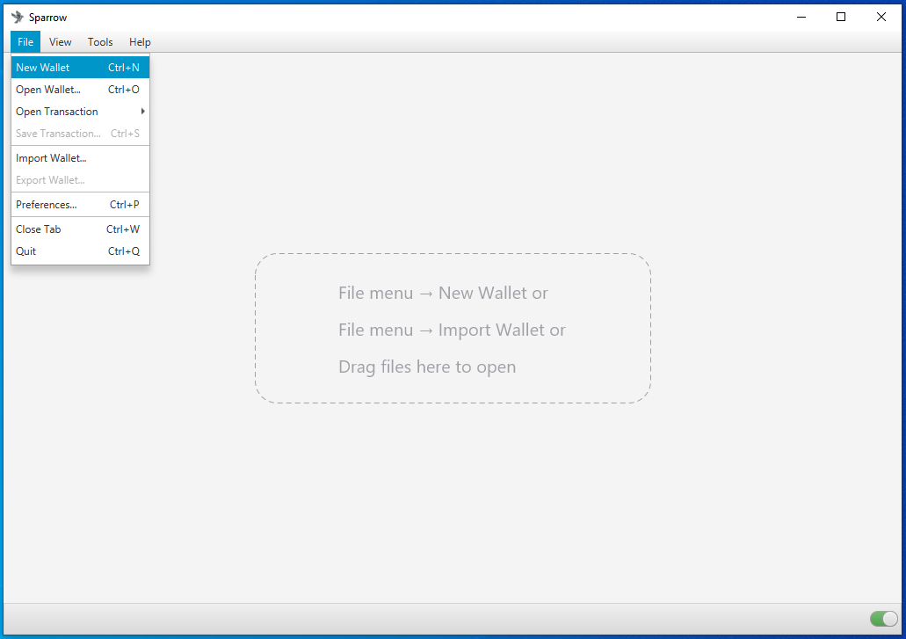
  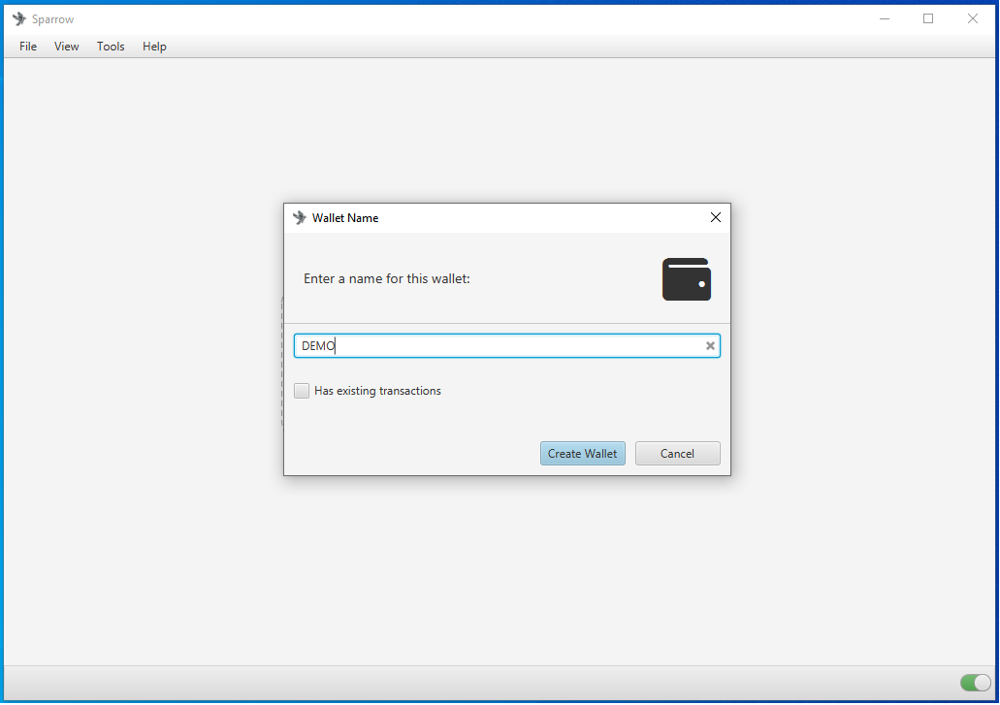

The next screen you will be presented with is going to ask you for some specific information about how you want to configure your new wallet. For the purposes of a Whirlpool hot wallet, the following default options are fine:

- Policy Type: `Single Signature`
- Script Type: `Native Segwit (P2WPKH)`
- Script Policy Descriptor: `wpkh(Keystore1)`
- Then under the `Keystore 1` section choose: `New or Imported Software Wallet`

  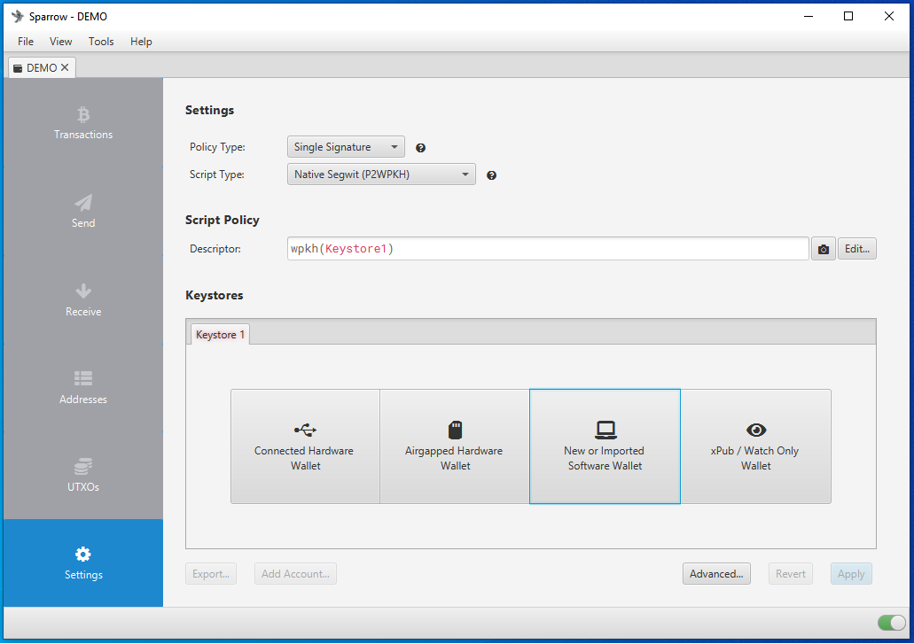

  
On the screen that pops up, click on the drop down menu that says <kbd>Use 24 Words</kbd> and select how many seed words you want in your seed phrase. 24-words are used for this demonstration. Then click on the button that reads <kbd>Use 24 Words</kbd>, or what ever number of words you selected. 
  

  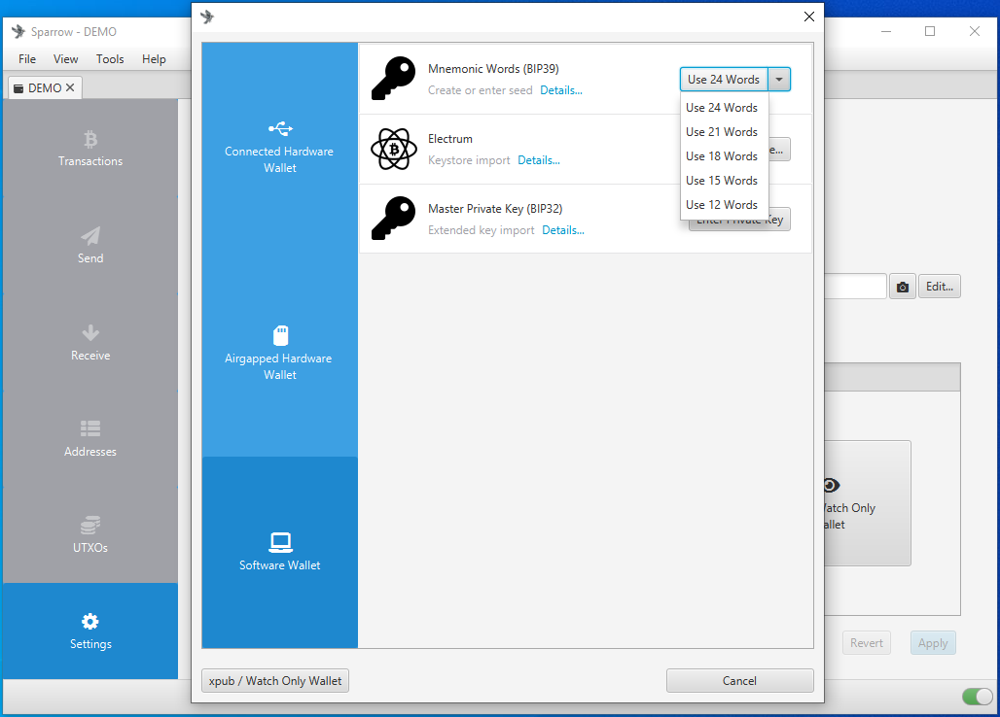

  
  
Next, you will be presented with a screen full of blank cells for your seed words. Click on <kbd>Generate New</kbd> and these cells will be filled in from the results of the Sparrow Wallet Random Number Generator. 

  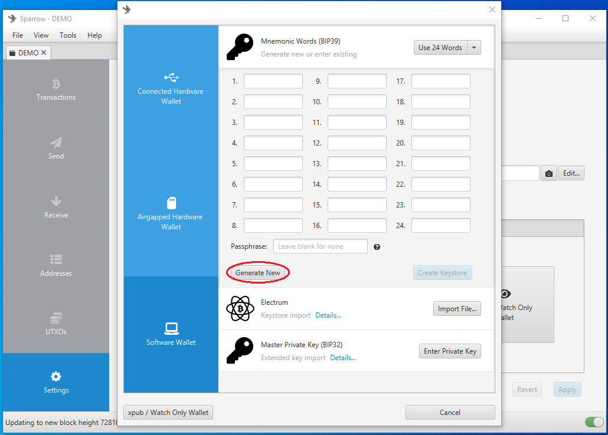
  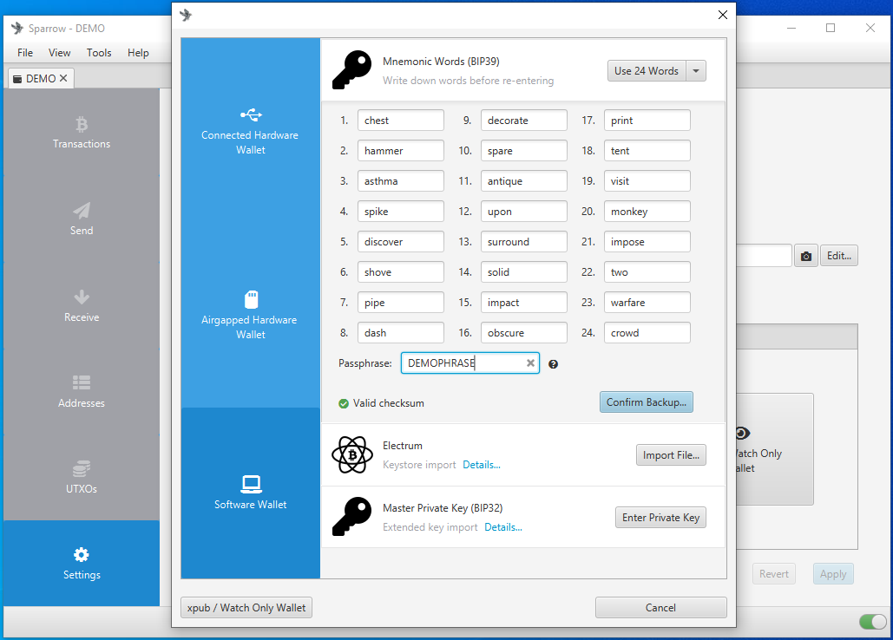

Ensure that you write these words down, in order, in a note book or other piece of paper that you can keep secure in the way you would with gold, cash, or jewelry. Never share these words with anyone, they will have access to your bitcoin. Do not take a screen shot of these words. Do not take a photograph of these words. Do not say them out loud. Do not put them in a text file.

The passphrase is optional but recommended. If anyone ever gains access to your seed words, then the passphrase will be the only thing protecting your bitcoin. Using a high entropy passphrase will make it difficult for anyone to guess your passphrase. Ensure that you also write this passphrase down, you will not be able to restore your wallet without it in the event that you need to attempt to recover your bitcoin. There is no way for the wallet to know what your passphrase is and any passphrase you enter will be accepted. If you enter the passphrase incorrectly in the future due to forgetting or losing it, you will lose access to your bitcoin. Also, consider storing your passphrase seperately from the seed phrase because if anyone finds them together then for sure they will swipe your bitcoin. 
  
Many people choose to stamp their seed words and passphrase into a metal medium because it can withstand extreme environments like fire and flooding better than paper. For this kind of wallet though, you may only be using it as a pass through to get mining rewards through Whirlpool before depositing them to your COLDCARD. Perhaps given the short time you will have bitcoin in this wallet is reason enough to not go through the trouble of stamping the information into metal. The choice is totally up to you and there are many options out there like the [SEEDPLATE](https://bitcoinseedbackup.com/) from Coinkite.  
  
After clicking on <kbd>Confirm Backup</kbd> you will see a dialog box popup asking you if you have written the seed words down, click on <kbd>Re-enter Words</kbd>.
  
Then type all your seed words in order and enter your passphrase. If you make a spelling mistake, the wallet will warn you by highlighting the incorrect word in red. Once everything is correct and you have entered your passphrase, click on <kbd>Create Keystore</kbd>. 

 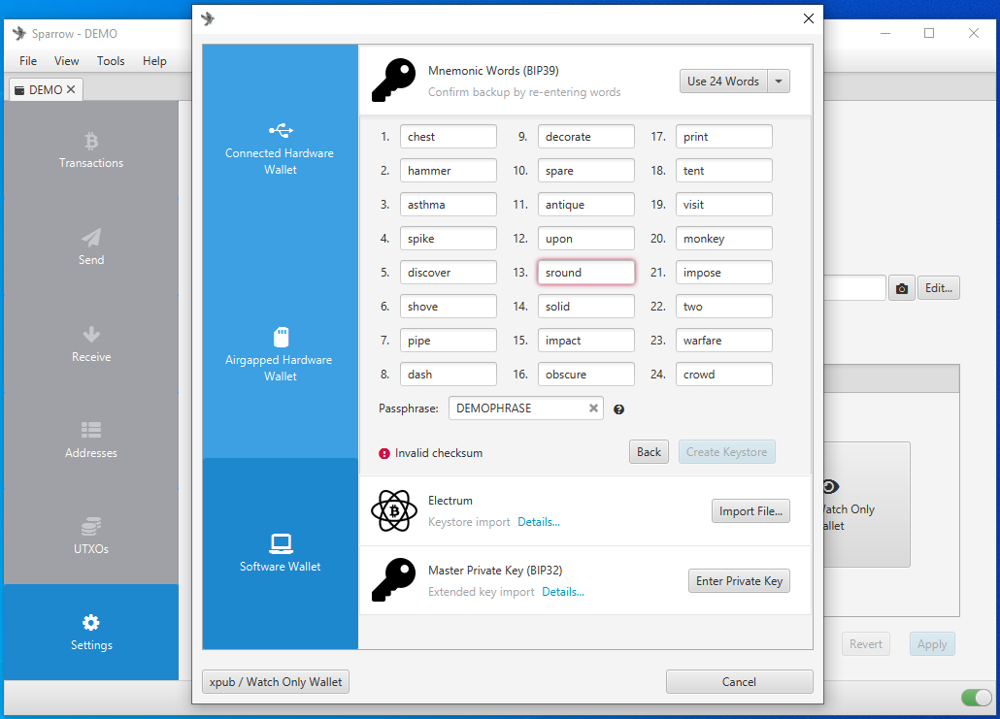

The next screen will show you the derivation path, leaving this as the default is fine and recommended unless you have a specific reason you want to change it and you understand the implications of doing so. Click on <kbd>Import Keystore</kbd>, leaving the account from the drop-down menu on the default setting, `#0`. You will be asked to enter your passphrase again in a pop-up dialog.  

 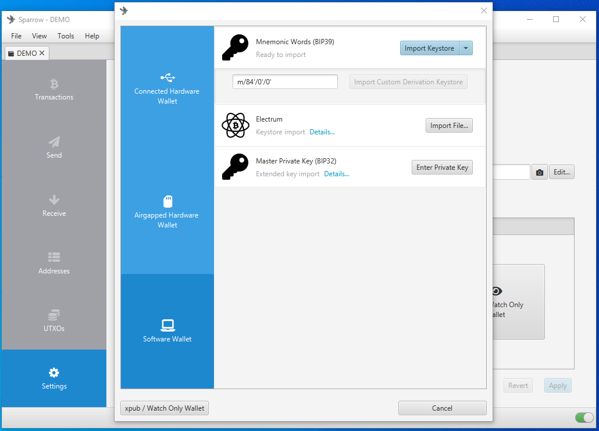

The next screen will display the summary details of the wallet you have just created. One important item to note here is the `Master Fingerprint`. This is a unique checksum that accompanies your passphrase. Any passphrase you enter will generate a different fingerprint. This is how you can verify that you have entered your passphrase correctly the next time you open this wallet. You can always come back to this page and find this information when you select the `Settings` tab from the left-hand side menu. You can store your fingerprint with your passphrase, this does not compromise your security. Once you have you the fingerprint written down, click on <kbd>Apply</kbd>. 

You will be asked if you would like to add a password to this wallet. This password is different than your passphrase, the password is used to encrypt the wallet data file that Sparrow Wallet saves on your computer. Having this file password protected will add an additional layer of security in case anyone gains access to your computer. 

 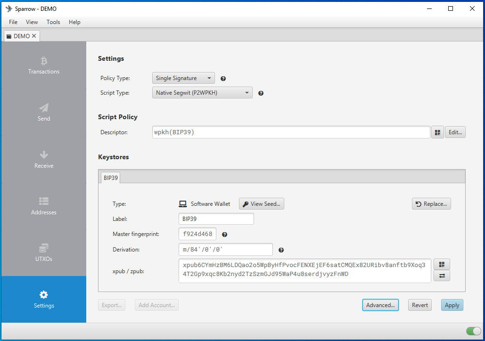

## Using Whirlpool
Now that you have your wallet all setup, you are ready to start using Whirlpool. You will need some bitcoin deposited into your wallet first. To get a receiving address, navigate to the `Receive` tab on the left-hand side menu and you will be presented with a QR code and the text of your first bitcoin address. You could copy/paste this address into your SlushPool account and have your mining rewards automatically deposited there. Changing your SlushPool reward address in between each payout can help you preserve your privacy. 

 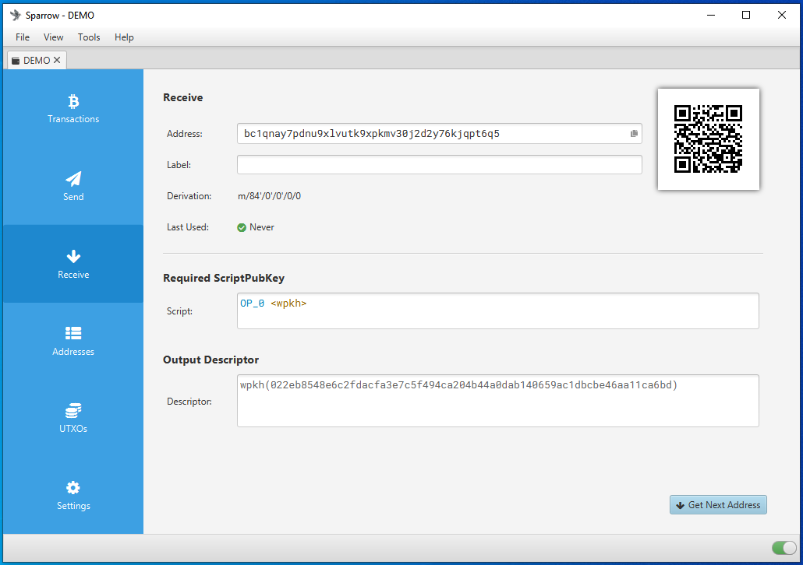

Once you receive your first payout, you will see the transaction appear in Sparrow Wallet, under the `Transactions` tab on the left-hand side menu. In this example, 0.01 BTC was received. 

 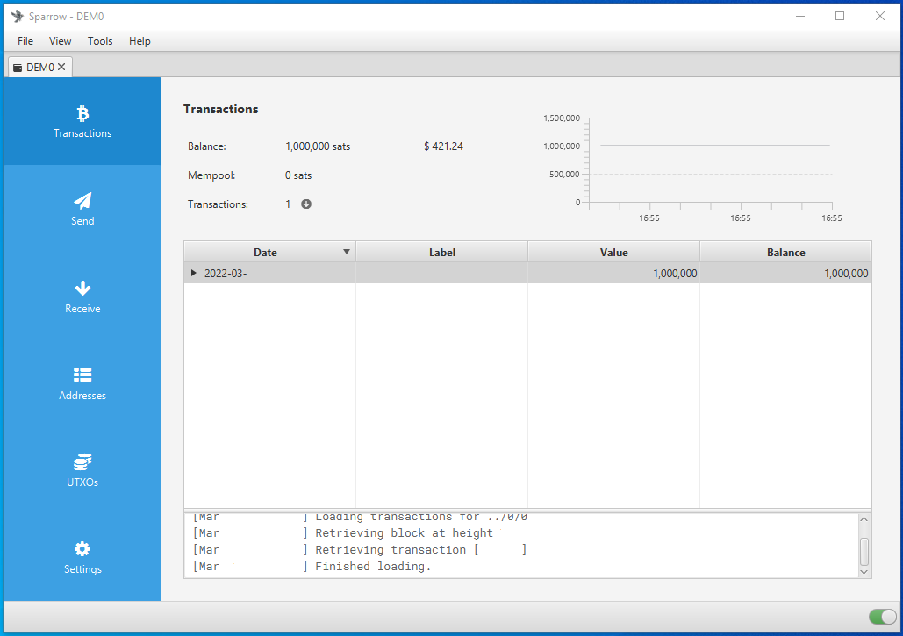

Now that you have some bitcoin, navigate to the `UTXOs` tab in the left-hand side menu and then select the UTXO you are interested in. You will see the `Mix Selected` button appear once you select the UTXO(s). Click on that button and then click `Next` in the two pop-up explainer windows that describe the Whirlpool process.  

 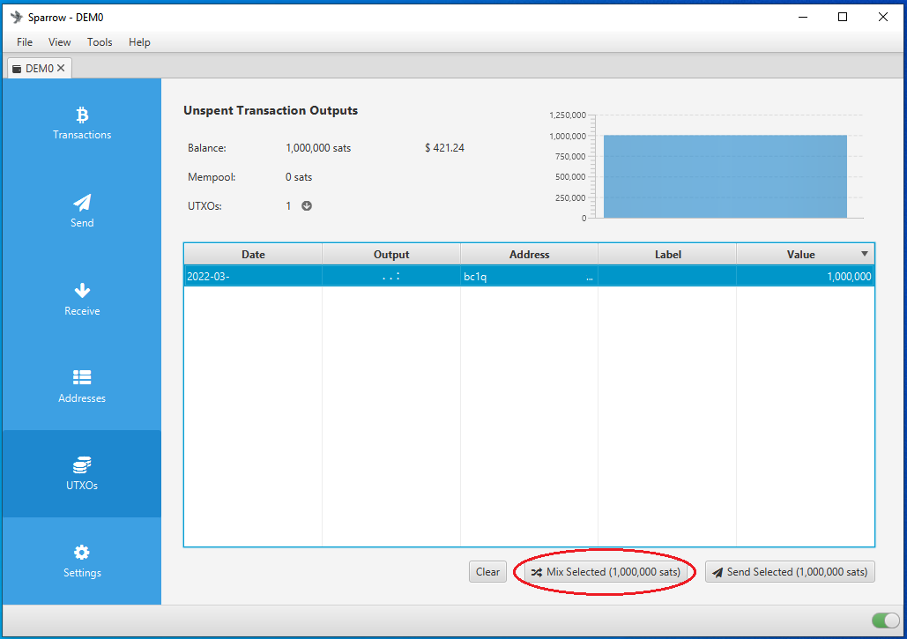

Then if you have an "SCODE" you can enter it in the third window. The "SCODE" can be used for discounted CoinJoin fees announced by [@SamouraiWallet](https://twitter.com/SamouraiWallet). Then click on <kbd>Next</kbd>. 

 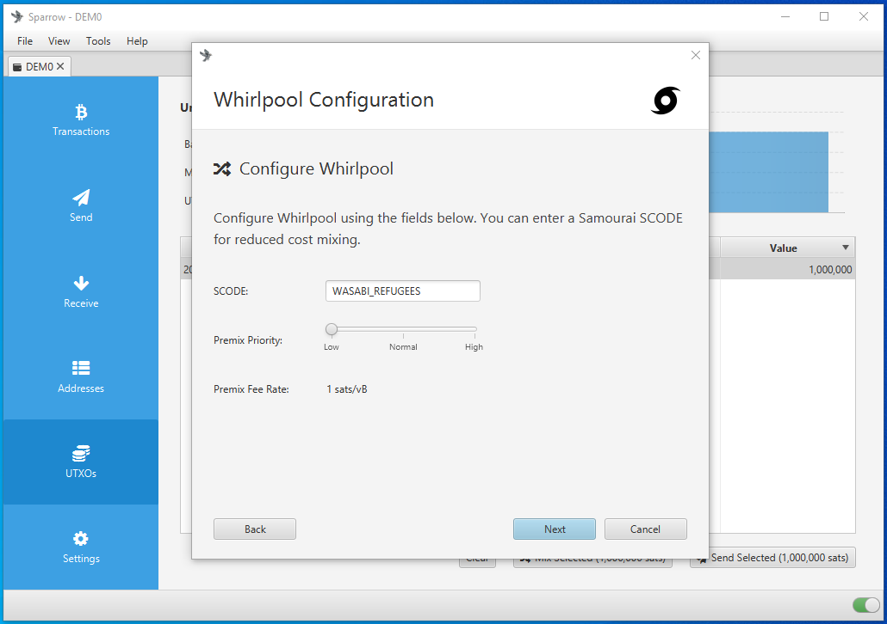
 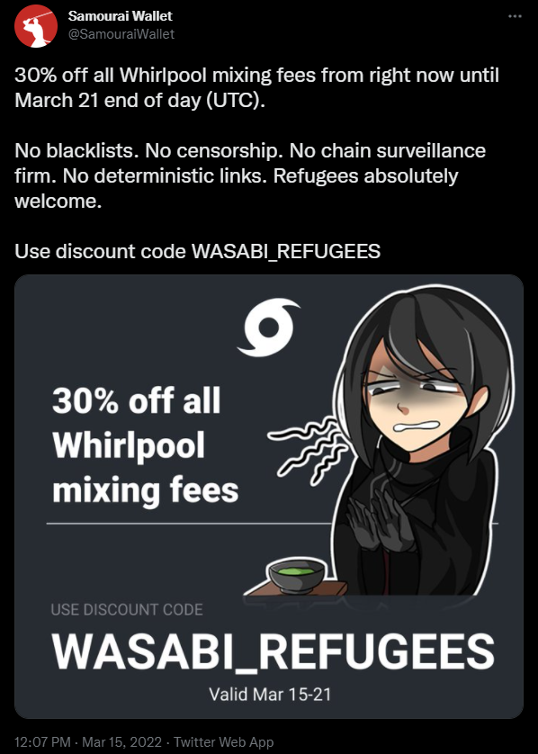

Then you will be presented with a preview describing which pool is appropriate for your BTC amount, the anonset, the pool fee, and how many UTXOs you will have as eligable inputs for CoinJoins. Then click on <kbd>Preview Premix</kbd>

 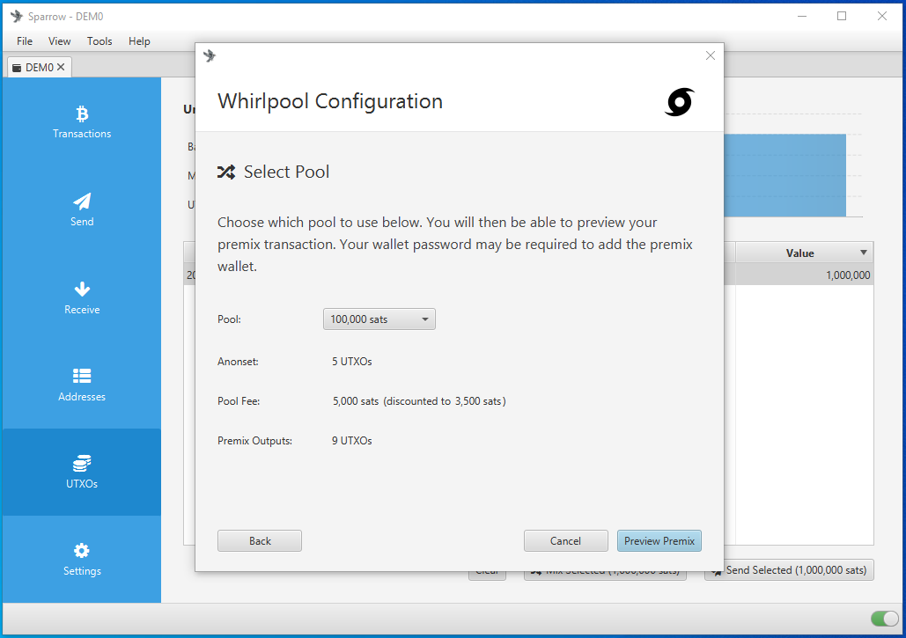

  

You will be presented with the overview of the transaction you are creating called "tx0". This transaction it what splits your input into the several outputs you are creating that will be used as inputs to the CoinJoin transactions you are about to participate in when Whirlpooling. 

You can check all the addresses you are sending to with the different tabs in the `Send` section. There is a graph which gives you a visual indication of how the transaction is being split up; noting the Whirlpool fee, Badbank Change, the Premix UTXOs, and the miners fee. If everything looks good, click on `Broadcast Premix Transaction`. 

 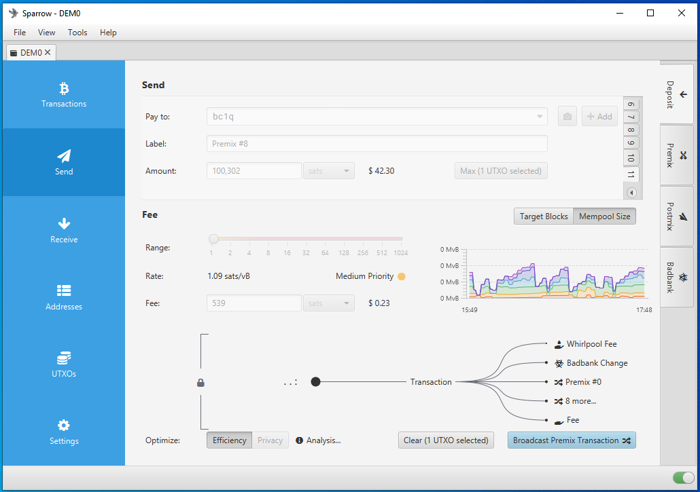

 

You'll also notice that four additional tabs showed up on the right-hand side of Sparrow Wallet. These are basically four separate wallets you have so that you can manage your bitcoin safely.

- The `Deposit` tab will be where you generate receiving addresses, this works just like any other bitcoin wallet, you can send from here too if you wanted to just make a normal bitcoin transaction.
- The `Premix` tab is where you can view the history of your pre-mix UTXOs, you do not want to manually receive or send bitcoin from this wallet. 
- The `Postmix` tab is where you will see your UTXOs after they have been mixed. All the UTXOs in this wallet have been through at least one CoinJoin transaction. So long as you leave these UTXOs in here, they will continually be registered as available UTXOs when new liquidity enters the Whirlpool and they will re-mix for free. So the longer you leave UTXOs in here, the more mixes they will get and the more anonymity you will achieve. 
- The `Badbank` tab is where your toxic change from the "tx0" gets sequestered from the rest of your funds. You want to be careful what you do with this toxic change. If you combine it with your postmix UTXOs then you will be degrading the privacy gains you got in Whirlpool. 

 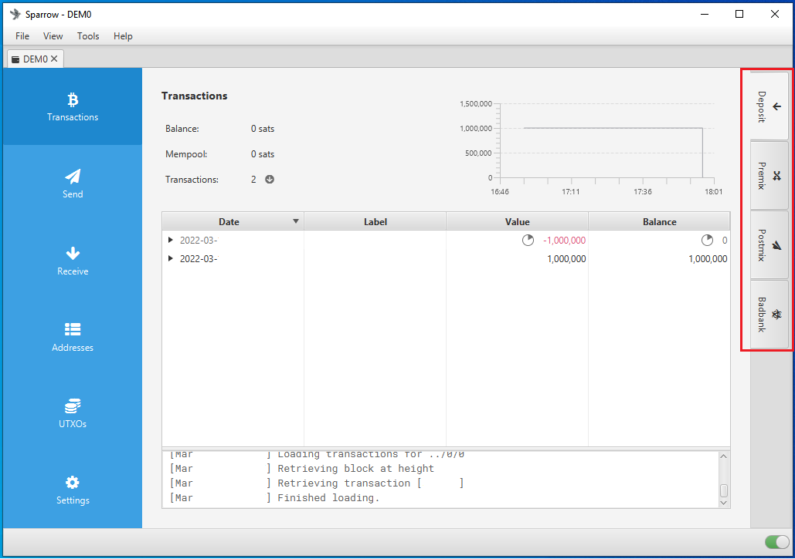

 

And that's how to use Whirlpool in Sparrow Wallet. Another great benefit are the build in postmix spending tools that allow you to better preserve your anonymity. For an overview of how these transaction work check out [this guide](https://www.econoalchemist.com/post/putting-the-who-in-cahoots) on collaborative spends, although the instructions are not specific to Sparrow Wallet, you will understand the mechanics of what these transactions are doing. 

Next, you'll see how to configure your COLDCARD as a Watch-Only wallet in Sparrow Wallet which allows you to keep an eye on your balance and generate receiving addresses while keeping the COLDCARD totally air-gapped. Once the Watch-Only wallet is imported then it can be set to deposit to directly from Whirlpool CoinJoins. 

## Sparrow as a Watch-Only wallet
In order to keep your COLDCARD air-gapped, the Partially Signed Bitcoin Transaction (PSBT) can be utilized to spend bitcoin from the COLDCARD without ever connecting it to the internet. Basically, the public information from the COLDCARD called an XPUB will be used to import the necessary information into Sparrow Wallet on our desktop. By doing this, Sparrow Wallet will be able to generate receive addresses and QR codes, monitor the COLDCARD's balance, and initiate PSBT's. All without exposing any of the private information from the COLDCARD, like the signing key. 

You will use the microSD card to transfer information between the desktop and the COLDCARD. Ensure the microSD card is inserted to the COLDCARD. 

First, the `.json` file needs to be exported from the COLDCARD, which will contain all the public information necessary so that Sparrow Wallet can import this watch-only wallet. From the COLDCARD main menu select `Advanced` > `MicroSD Card` > `Export Wallet` > `Generic JSON`. 

  
  

  
  

This is going to write the file to the microSD card, then you can connect that microSD card to your desktop computer with your USB adaptor. Copy/paste the exported `.json` file to your desktop from the microSD card. Note the file location and now you will switch back to Sparrow Wallet to get it ready to import the `.json` file. 

In Sparrow Wallet, create a new wallet by selecting `File` > `New Wallet`, then you will be asked to name this wallet. Name the wallet whatever you want then click on <kbd>Create Wallet</kbd>.

  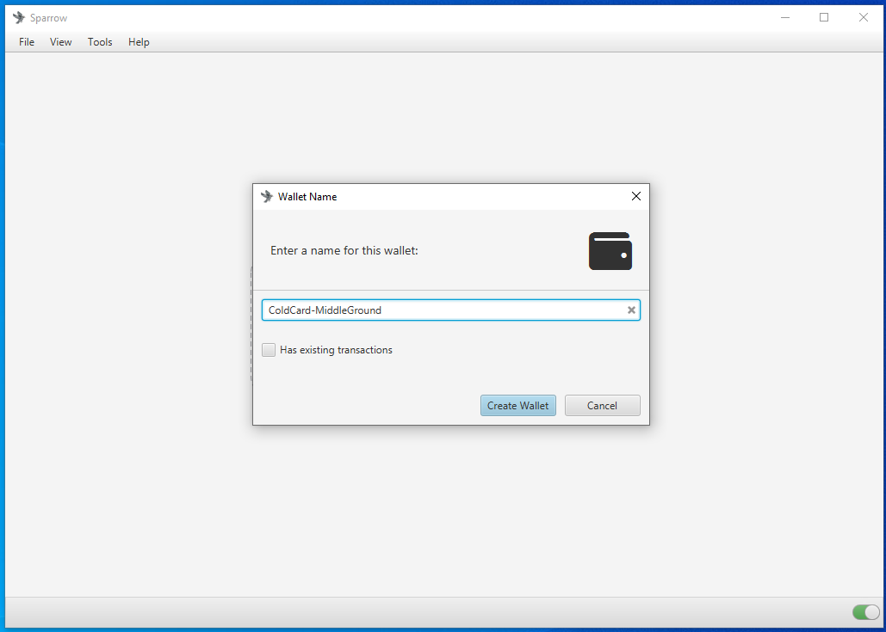

You will see the following screen, you can leave all the settings on the defaults. Then select <kbd>Airgapped Hardware Wallet</kbd>. 

  

A screen will pop up and you can click on the <kbd>Import File...</kbd> button next to the COLDCARD icon. This will open your file explorer where you can point Sparrow Wallet to the file location containing the exported COLDCARD `.json` file. Select that file and click on <kbd>open</kbd>. 

  

After a moment, you will see a summary of the wallet you are about to apply. You will notice a "Master fingerprint" dialog box with 8-characters in it. You can use this unique identifier to confirm that you are importing the correct wallet from your COLDCARD. 

On your COLDCARD, from the main menu, navigate down to `Advanced` > `View Identity` and you can compare the displayed fingerprint to the one displayed in Sparrow Wallet. This is especially important to confirm if you have added a passphrase which will be covered in the [Paranoid guide](https://coldcard.com/docs/paranoid)

If everything looks good, then click on <kbd>Apply</kbd> in Sparrow Wallet. 

  
  

After clicking on <kbd>Apply</kbd>, you will have the opportunity to add a password to your wallet. This is a password which will encrypt the Sparrow Wallet data file that is saved on your computer. This password can protect your wallet if someone else gains access to your desktop and Sparrow Wallet file. If you forget your password, you will need to create a new wallet file by repeating this whole process. 

  

You can also save a list of deposit addresses from your COLDCARD and compare this saved list to Sparrow Wallet to ensure the correct wallet is loaded without having to retrieve your COLDCARD, login to it, and compare the deposit addresses there. To do this, select the `Receive` tab in Sparrow Wallet then you can view the first receiving address from your COLDCARD and its QR code. On your COLDCARD, make sure you insert the microSD card and enter your passphrase if applicable. Then from the main menu, select `Address Explorer`. This will bring up a few address types that you can choose to view. Your COLDCARD can use legacy P2PKH Bitcoin addresses that start with "1", or nested SegWit P2SH Bitcoin addresses that start with "3", or Native SegWit Bech32 Bitcoin addresses that start with "bc1". Then you want to press <kbd>1</kbd> and this will save the first 250 addresses to a `.csv` file on your microSD card. You can also open the `addresses.csv` file with a text editor on your desktop to view the 250 addresses you exported from your COLDCARD and compare them to your Sparrow Wallet just for the added assurance. 

  

After applying the changes, you can now navigate through your watch-only wallet in Sparrow Wallet. On the left-hand side of the Sparrow Wallet interface there are six tabs: 

- The <kbd>Transactions</kbd> tab is where you can see information related to the transactions in this watch-only wallet. 
- The <kbd>Send</kbd> tab is where you can create the PSBTs to then export for signing by the COLDCARD. 
- The <kbd>Receive</kbd> tab is where you can generate receive address for your COLDCARD without having to plug in your COLDCARD and log into it. 
- The <kbd>Addresses</kbd> tab shows several deposit and change addresses as well as any balances. 
- The <kbd>UTXOs</kbd> tab shows any unspent transaction outputs and a small graph charting the history. 
- The <kbd>Settings</kbd> tab is where you can see detailed information about the watch-only wallet such as the master fingerprint, derivation path, & xpub.   

Now you can click on the <kbd>Receive</kbd> tab on the left-hand side of the Sparrow Wallet interface. Then you will be presented with a bitcoin receiving address, a QR code, and some additional details. You can scan this QR code with your mobile Bitcoin wallet, for example, and deposit some bitcoin to your COLDCARD. You should see the transaction show up in Sparrow Wallet after a moment along with a pop-up notification. Also, in BitcoinCore, the transactions should show up there as well. The transaction will remain in a pending status until it receives some blockchain confirmations. In the mean-time, you can click on the <kbd>Transactions</kbd> tab and review further details about your transaction. You can also copy/paste your transaction ID in [mempool.space](https://mempool.space/) to watch for your first confirmation, or use whatever your preferred block explorer is. [Tor Browser](https://www.torproject.org/download/) is a privacy-focused browser.  

  
  
  
  

Now you can power off and secure your COLDCARD in a safe place until you want to sign a transaction and spend from it, several addresses will be cataloged in Sparrow Wallet so you can continue depositing to your COLDCARD via Sparrow Wallet without having to reconnect it every time. It is best practice to confirm each receiving address on the COLDCARD itself and or your saved `.csv` file and additionally to only use each address once. Sparrow Wallet now has all the information it needs to starting depositing Whirlpool outputs directly to your COLDCARD. 

## Mixing Straight to COLDCARD
One really cool feature of Whirlpool is that you can mix straight to your COLDCARD. You can set the number of mixes you want each UTXO to achieve and as your UTXOs re-mixes hit that number they will be deposited to your COLDCARD straight from a CoinJoin transaction. Additionally, Sparrow Wallet will add an additional source of randomness to help you avoid creating paterns that could be used as on-chain heuristics; each UTXO that hits your set number of re-mixes will have a 25% chance of being mixed again. When you receive deposits to your COLDCARD straight out of a CoinJoin transaction, it looks as though that UTXO is still in Whirlpool to any outside observer looking on-chain. 

Navigate to the `UTXOs` tab on the left-hand side and the `Postmix` tab on the right-hand side, these are all of your mixing UTXOs. At the bottom, click on <kbd>Mix to</kbd>. 

 

 

A window will pop up and from the `Mix to wallet` drop-down menu, select the COLDCARD Watch-Only wallet that you imported. Then you can set the minimum number of mixes you want each UTXO to achieve before being deposited to your COLDCARD. Keep in mind, each UTXO will have a 25% chance of being mixed again even after it hits this number. You can leave `Index range` on the default `Full` setting to use both even and odd indexed addresses. Then click on <kbd>Restart Whirlpool</kbd>. 

 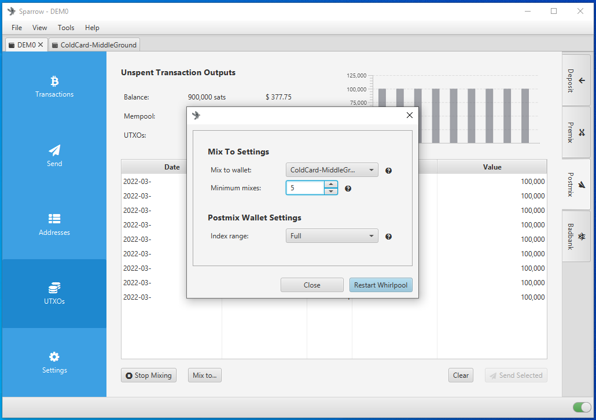

Then you will notice that the button at the bottom has changed to display the wallet you have selected for the automatic deposits.

 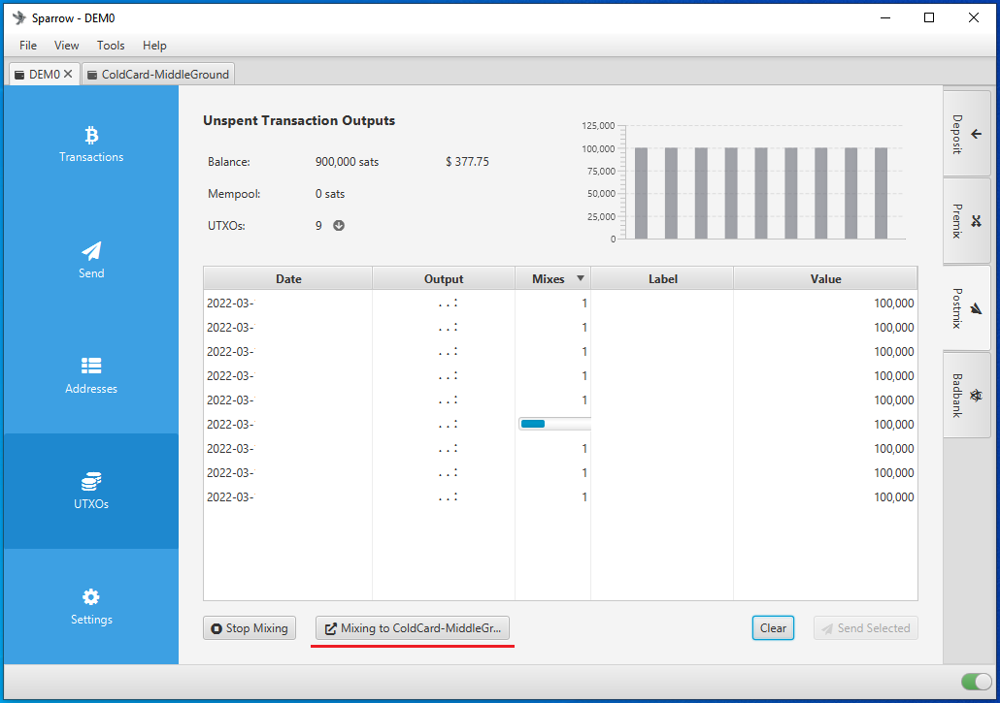

Now you can just leave your UTXOs to re-mix and as they achieve enough mixes they will be automatically deposited to your COLDCARD. Next, you'll see how to spend from your COLDCARD using Sparrow Wallet and keeping your COLDCARD fully air-gapped. 
 
## Signing with the COLDCARD
When you are ready to sign a transaction to spend bitcoin, it is necessary to create a PSBT in order to maintain the air-gapped benefit. You can deposit bitcoin with your COLDCARD disconnected but to spend bitcoin, the COLDCARD needs to sign the transaction. Sparrow Wallet is used to build the transaction based on your available Unspent Transaction Outputs (UTXOs) and the information you enter when constructing the transaction. The PSBT details are passed between Sparrow Wallet and the COLDCARD using the microSD card. 

To create a PSBT, navigate to the <kbd>Spend</kbd> tab on the left-hand side in Sparrow Wallet. There, you can paste the address you are sending to, add a label, enter an amount to send, and choose a miners fee rate, etc. Once you have everything set, click on <kbd>Create Transaction</kbd>. On the next screen, double check the details then click on <kbd>Finalize Transaction for signing</kbd>. Then you will be asked what you want to do with the finalized PSBT. In this case, click on <kbd>Save Transaction</kbd> and Sparrow Wallet will launch the file explorer. Navigate to the microSD card and save the PSBT there. Then safely eject the microSD card.  

  
  
  
  

  
Insert the microSD card into the COLDCARD. If necessary, power on your COLDCARD using the COLDPOWER 9v battery adaptor or USB adaptor. Then enter your COLDCARD PIN prefix, verify your anti-phishing words, and enter the PIN suffix. From the main menu choose `Ready to Sign`. Then the details of the PSBT will be displayed and you can confirm that the address and the amount and the miners fee are correct.    

  
  
  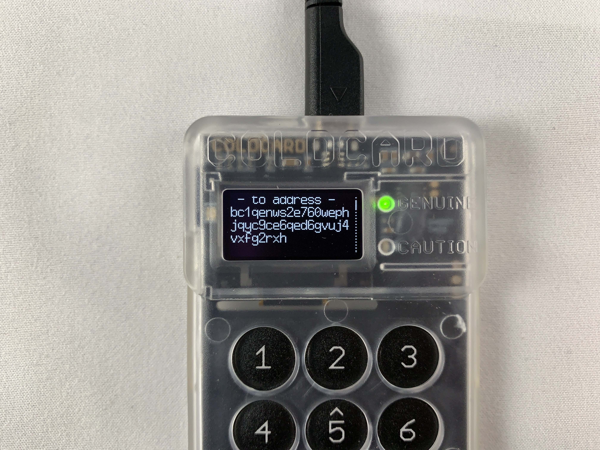
  

  
Then hit <kbd>OK</kbd> to sign. Once the file is signed it will be saved as a new file to the microSD card. You can then eject the microSD card and securely log out of your COLDCARD and power it down. 
 

  

Eject the microSD card from the COLDCARD, insert to the USB adaptor, insert the adaptor into the desktop computer. Ensure BitcoinCore and Sparrow Wallet are open. Then from the file explorer, simply double-click on the signed PSBT file and it should open automatically in Sparrow Wallet. Alternatively, from Sparrow Wallet navigate to `File` > `Open Transaction` then choose `File` from the menu of options and navigate to the file location of the signed PSBT. Either way, then click on the <kbd>Broadcast Transaction</kbd> button to send the signed transaction to the Bitcoin Network. 

  
  

                                                          
At the time of broadcast you should see the transaction in BitcoinCore as well as receive a notification in Sparrow Wallet. Again, you can copy the transaction ID and paste in your preferred block explorer to watch for confirmations.
                                                          

  

The main point here is that your COLDCARD is the required signing device while your Sparrow Wallet is your interface, transaction builder, & broadcaster. In this configuration, Sparrow Wallet can do many things like catalog addresses and build transactions but without the signature from your COLDCARD, Sparrow Wallet cannot authorize spending of any of your bitcoin. 

